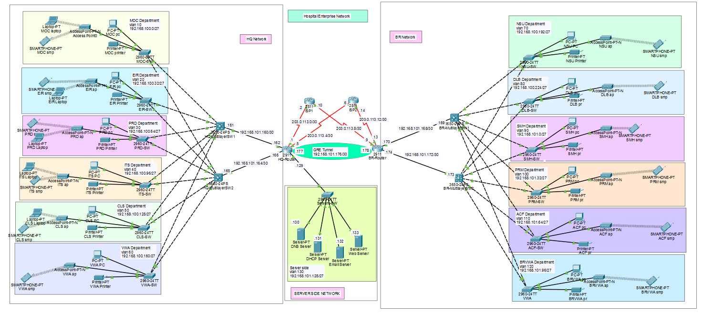

# Hospital Enterprise Network | HSRP | OSPF | GRE Tunnel | PAT

## Enterprise Hospital Network Design | Dual-Branch Redundancy | VLAN Segmentation | Wireless Integration

---

## Project Overview

This project implements a **full-scale enterprise hospital network** with two locations: **Headquarters (HQ)** and **Branch Hospital**. Both locations are connected via a **GRE tunnel** allowing broadcast and multicast traffic to pass between sites. The network serves 12 departments across both locations with:

- **HSRP (Hot Standby Router Protocol)** for default gateway redundancy at each site
- **OSPF** dynamic routing across the entire infrastructure
- **GRE tunnel** connecting HQ and Branch with route sharing
- **PAT with dual ISP failover** (static + floating static routes)
- **VLAN segmentation** with inter-VLAN routing via multilayer switches
- **DHCP relay** from centralized servers with HSRP-aware load balancing
- **Port security** on server-side network
- **SSH and console password protection** on all network devices
- **WPA2-PSK** on department-specific wireless access points

---

## Network Topology



---

## IP Addressing Scheme

### Headquarters (HQ)

| Department | VLAN ID | Network Address | Subnet Mask | CIDR | Gateway | Host Range |
|------------|---------|----------------|-------------|------|---------|------------|
| Medical, Operations & Consulting (MOC) | 10 | 192.168.100.0 | 255.255.255.224 | /27 | 192.168.100.1 | .1 - .30 |
| Emergency & Incident Response (EIR) | 20 | 192.168.100.32 | 255.255.255.224 | /27 | 192.168.100.33 | .33 - .62 |
| Patient Records Department (PRD) | 30 | 192.168.100.64 | 255.255.255.224 | /27 | 192.168.100.65 | .65 - .94 |
| IT Support & Systems (ITS) | 40 | 192.168.100.96 | 255.255.255.224 | /27 | 192.168.100.97 | .97 - .126 |
| Client Services (CLS) | 50 | 192.168.100.128 | 255.255.255.224 | /27 | 192.168.100.129 | .129 - .158 |
| Visitor Waiting Area (VWA) | 60 | 192.168.100.160 | 255.255.255.224 | /27 | 192.168.100.161 | .161 - .190 |

### Branch Hospital

| Department | VLAN ID | Network Address | Subnet Mask | CIDR | Gateway | Host Range |
|------------|---------|----------------|-------------|------|---------|------------|
| Nursing & Surgical Unit (NSU) | 70 | 192.168.100.192 | 255.255.255.224 | /27 | 192.168.100.193 | .193 - .222 |
| Diagnostic Laboratory (DLB) | 80 | 192.168.100.224 | 255.255.255.224 | /27 | 192.168.100.225 | .225 - .254 |
| Staff Management - HR (SMH) | 90 | 192.168.101.0 | 255.255.255.224 | /27 | 192.168.101.1 | .1 - .30 |
| Public Relations & Marketing (PRM) | 100 | 192.168.101.32 | 255.255.255.224 | /27 | 192.168.101.33 | .33 - .62 |
| Accounts & Finance (ACF) | 110 | 192.168.101.64 | 255.255.255.224 | /27 | 192.168.101.65 | .65 - .94 |
| Branch Visitor Waiting Area (BRVWA) | 120 | 192.168.101.96 | 255.255.255.224 | /27 | 192.168.101.97 | .97 - .126 |

### Server & Management Network

| Network | Network Address | Subnet Mask | CIDR | VLAN ID |
|---------|----------------|-------------|------|---------|
| Server Side Network | 192.168.101.128 | 255.255.255.240 | /28 | 130 |

**Gateway is always the first usable address in each subnet.**

---

## Technologies Implemented

| Technology | Purpose |
|------------|---------|
| VLANs 10-120 (12 departments) | Department isolation across both sites |
| Inter-VLAN Routing (Multilayer Switches) | Layer 3 routing between VLANs |
| HSRP (Hot Standby Router Protocol) | Redundant default gateways at HQ and Branch |
| HSRP Load Balancing | Different VLANs prefer different active routers |
| OSPF | Dynamic routing between HQ router, Branch router, and all multilayer switches |
| GRE Tunnel | Site-to-site connectivity with broadcast/multicast support |
| PAT (Port Address Translation) | Internet access for internal hosts |
| Dual ISP with Static + Floating Static Routes | ISP redundancy and failover |
| ACL for NAT | Only internal traffic (not site-to-site) uses PAT |
| DHCP Server (Centralized) | Dynamic IP allocation across all VLANs |
| DHCP Relay Agents | Multilayer switches forward DHCP requests to server |
| Port Security | Server-side network access control |
| WPA2-PSK | Wireless security for department APs |
| SSH v2 | Secure remote management on all network devices |
| Console Line Password | Physical access security |
| Static Routing | Default routes and backup routes |

---

## Technologies Summary

| Category | Technologies Used |
| --- | --- |
| Routing | OSPF, Static Routes, Floating Static Routes, PAT, GRE Tunnel |
| Switching | VLANs, Trunking, Inter-VLAN Routing (SVI), Port Security |
| Redundancy | HSRP, Dual ISP, Floating Static Routes |
| Services | DHCP (Centralized with Relay), DNS, Email |
| Security | ACL (NAT exclusion), SSH v2, Console Passwords, WPA2-PSK |
| Wireless | Department-specific APs with WPA2-PSK |

---

## Architecture Summary

### Headquarters (HQ)
- **HQ Router** connects to outside internet (dual ISP)
- **Two Multilayer Switches** act as default gateways with HSRP
- Each department has a dedicated **Layer 2 switch** connected to both multilayer switches
- Each department has a **wireless access point** (WPA2-PSK)
- **Server Side Network** hosts DHCP, DNS, and Email servers

### Branch Hospital
- **Branch Router** connects to outside internet (dual ISP)
- **Two Multilayer Switches** with HSRP (same design as HQ)
- **6 department switches** with access points
- **GRE tunnel** between HQ and Branch routers carries OSPF updates

### Connectivity
- HQ and Branch connected via **GRE tunnel**
- **OSPF** advertises all routes across the tunnel
- **PAT** configured on both routers for internet-bound traffic
- **ACL ensures** site-to-site traffic does NOT get translated (uses GRE instead)

---

## Verification

All verification outputs (show commands, ping tests, HSRP status, OSPF neighbors, GRE tunnel status) are available here:  
👉 [View Verification Results](Verifications.md)

---

## Configurations

All device running configurations (routers, multilayer switches, L2 switches, access points) can be accessed here:  
👉 [View Device Configurations](Configs/)

---

## How to Use This Project

### Prerequisites
- Cisco Packet Tracer 8.2 or higher  

### Steps
1. Clone or download this repository  
2. Open `Hospital-Enterprise-Network.pkt` in Cisco Packet Tracer  
3. Allow devices to fully boot (30–60 seconds)  
4. Verify OSPF neighbors: `show ip ospf neighbor`  
5. Verify HSRP status: `show standby`  
6. Verify GRE tunnel: `show interface tunnel 0`  
7. Test inter-VLAN ping across both sites  

---

## Project Structure

```text
Hospital-Enterprise-Network-HSRP-OSPF-GRE/
├── Hospital-Enterprise-Network.pkt
├── Topology.png
├── README.md
├── Verification.md
└── Configs/
    ├── HQ-Router.txt
    ├── BR-Router.txt
    ├── ...
```

---

## Author

Mohamed Bashir Ali

---

## License

This project is for educational and portfolio purposes.
